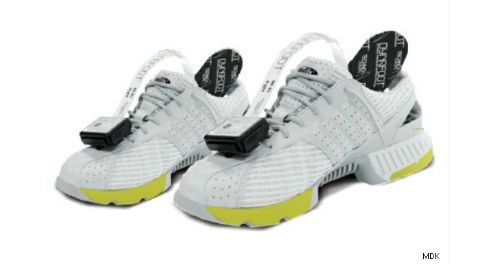
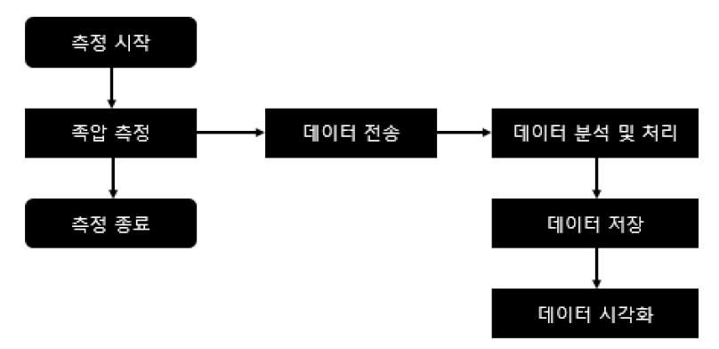
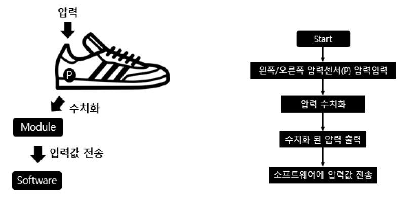
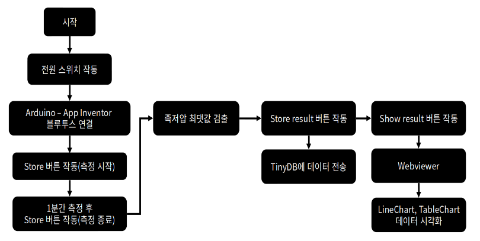
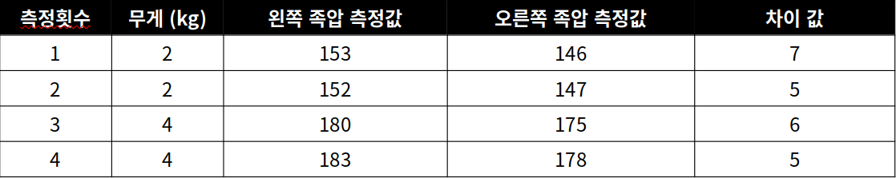
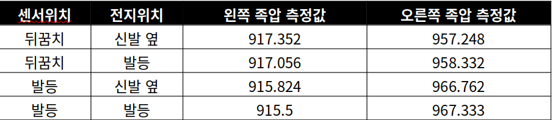
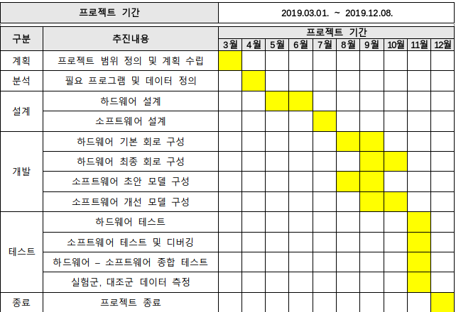
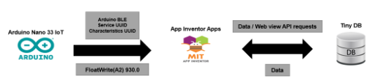
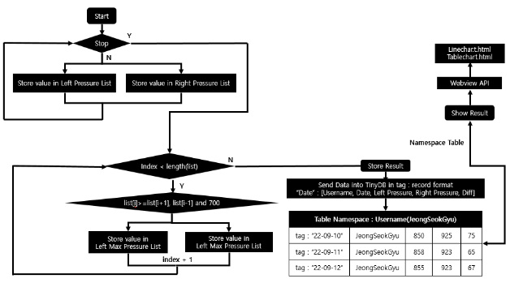

# Project : Scolosis Tracking Shoes

- Project name : Scolosis observation project using foot pressure 
- Participation : Jeong Seok Gyu(201724570, PNU), Lee Doo Gyeong(201724525, PNU) 
- Proudct name : Scolosis tracking shoes 

# 1. Summarization 

|About product|Contents|
|:---:|:---| 
|Project name|Scolosis observation project using foot pressure| 
|Introduction|The foot pressure measurement device is a device that can measure the static foot pressure of a user, measure dynamic walking, and anlyze it, and is a user-friendly and easy to move. Within the project, a foot pressure measurement device was used to track the deepening and mitigration of scolosis, which is cost-effective compared to follow-up observation using conventional imaging equipment by measuring pressure differences in both feet. This work stores pressure sensor data measured through Bluetooth communication between Android and Apps in a smartphone, manipulates it through buttons in App Inventor application, and provides visualization plots with 2D Line chart and Table chart.| 
|The background and necessity| The number of patients with spinal diseases in Korea is steadily increasing. Among them, in the case of scolosis, follow-up observation using imaging equipment is emphasized. The need for a device for managing scolosis that team members are actually experiencing is reconsidered.| 
|The characteristics and advantages|We store the data obtained in real time through pressure sensor inside the database inside the application and provide a visualization plot for scolosis observation. It is a device that can observe the degree of scolosis through a simple self-measurement method without using an expensive device.| 
|The contents of the project|The work is divided into hardware and software parts. In the case of hardware, the pressure is measured through an FSR sensor, and the measured value is transmitted using Arduino's Bluetooth module. In particular, ArduinoIDE converts it into ADC units through the analogRead function and sends it to the application. In the software, the application was written through the App Inventor. The measured data is received in real time through Bluetooth communication, measured, and then the maximum pressure values of the measured pressures are extracted through a maximum-average value algorithm, calculated, and stored in TinyDB. In addition, visualization plots of stored data were provided as 2D Line-chart and Table-chart through the Google WebView API.|
|The expected effects and utilizations of the project|There is no need to move to medical institution to measure foot presure data through the product, so there are no spartial restrictions. Accessibility was improved using graph and charts to make it easier to interpret data by using user mobile devices.| 

# 2. Main text 

## 2.1 Overview 

### 2.1.1 Introduction

- Foot pressure measuring device 
  - A foot pressure measuring device is a device capable of measuring the static foot pressure of a user and measuring and analyzing dynamic walking, and is user-friendly and easy to move. 
  - It is used for body shape and posture analysis through static foot pressure and dynamic walking pressure measurement, walking analysis, static balance, foot pressure distribution, maximum pressure test of each foot, and body center measurement. 
  - Within the project, a foot pressure measurement device is used to track cost-effective scolosis deepening and mitigation compared to follow-up using conventional imaging equipment by measuring pressure differences in both feet. 
  - In other words, a device allows patients with scolosis to receive treatement and direction through daily observation records and consultation through quantitative records. 
  
 
 
- Intention of the project 
  - The spartial disease is a disease that must be costantly managed. 
  - If care is negelected, pain may worsen or develop into other spinal diseases. 
  - Management of spinal disease is mainly performed by follow-up using imaging equipment, but must be taken be visiting the hospital. 
  - The object of project is to develop a device that can track and observe spinal diseases through simple self-measurement without using expensive devices. 
  
- Contents of the project 
  - Store pressure sensor data measured by Bluetooth communication between Android and MCU in a smartphone database. 
  - Operate buttons on App Inventor application to provide visualization plots with 2D Line chart and Table chart. 
  
### 2.1.2 The background and necessity 

- An increase in the number of patients with sipnal diseases
  - As of 2015, the number of patients with spinal diseases in Korea was about 8.08 million, and as of 2020, the number of patitents with spinal disease in Korea was about 9.20 million, an increase of about 1.12 million(13%) over five years. 
  - In particular, the increase in patients with spinal diseases in the 20s was about 19%, the steepest increase in all age groups. 
  - Rapid growth in patients with spinal diseases in the 20s is influenced by increased use of potable IT devices and sitting time in incorrect posture and reduced exercise. 
  
- Diagnostic methods and management of scolosis 
  - Scolosis confirms its degrees through the Cobb angle using imaging equipment. The Cobb angle is the angle formed by a parallel line in the vertebrae located at either end of the curve and perpendicular to each line. 
  - According to the treatment policy of the Americal Scolosis Research Society, it is classified into observation, adjuvant, and surgical stages according to the degree. For the observation and adjuvant stages, the periodic follow-up based on imaging equipment and its recording is emphasized. 
  
- A team member's spinal disease
  - In the case of team member, Seok-Gyu Jeong, has scolosis with 22 degree. He has been steadily managed since the ocuurence of lumber pain in 2018. 
  - Scolosis is a typical disease that develops into herinated disc if management is neglected. 
  - Therefore, the need for a device to manage a disease directly experienced by team members is reconsidered.
  
### 2.1.3 The characteristics and advantages 

- The characteristics of a work 
  - The real-time data obtained through pressure sensors is transmitted to mobile devices via Bluetooth communication, and scolosis quantified by calculating the maximum average of the pressures of each foot. 
  - Provides a 2D Lie chart and Table chart visualization plot to store foot pressure sensor data measured for the user's desired time inside the application database and observe scolosis.
  
- The advantages of a work 
  - A device that can track and observe the degree of scolosis through a simple self-measurement method without using an expensive device. 
  - Measure pressure on both feet to facilitate periodic management of quantitative data. 
  - Continuous observations allow for earlier and faster observation and management of scolosis than imaging equipmenet. 

## 2.2 The contents of the project 

### 2.2.1 The composition diagram

- S/W composistion diagram 
  - Measured foot pressure data is received inside the application via Bluetooth communication. 
  - After filtering the foot pressure data of both feet based on the 700 ADC value, only the maximum value is extracted. Calculate the average value of the extracted maximum value and store it in the left maximum averaged pressure value and the right maximum averaged pressure value variable, respectively. 
  - Store data, username, left maximum averaged pressure, right maximum averaged pressure, and difference value in the TinyDB database. 
  - When the visualization button is pressed in the application, the visualization plot is provided in the form of 2D Line-chart, Table chart. 
  


- H/W composition diagram 
  - User puts on the device, then turns on the device. 
  - Converts the pressure input to the pressure sensor into ADC units through an analog to digital function inside the MCU 
  - $ADC = \frac{V_p \times 1024}{V_{REF}}$, $V_p$ = Input voltage of selected pin, $V_{REF}$ = Input voltage. 
  - Transmitted the converted pressure value to the App Inventor application via Bluetooth communication. 



- System composistion diagram 
  - User wears device, operates application to enable application Bluetooth communication with Arduino. 
  - Measure the foot pressure data via the Start button and exit the measurement via the Stop button. 
  - Calcualtes data to be automatically stored in the database within the application. The calculated data calculates the average value of the maximium values for the pressures of each foot and the difference of their values. 
  - Store analyzed data in the TinyDB database via the Store result button. 
  - Press the Show result button to check the 2D Line-chart and Table chart according to the username through the GoogleWebView API. 



### 2.2.2 The functions

- List of functions 

| Sortion | Functions | Explainations | Current Progress (%) | 
|:---:|:---:|:---|:---:| 
|S/W|Preprocessing and storing data|Arduino receives data sent to the application via Bluetooth communication and stores it inside the database|100|
|S/W|Maximum - average value calculation algorithm for both foot pressure| Filter values below 700 ADC inside the application, then extract maximums and calculate averaged values|100| 
|S/W|Provides a visualization plot of 2D Line-chart, Table chart to observe the trend of scolosis|Provides visualization plots of data stored inside the database into line graph and table through the Google WebView API|100| 
|H/W|Pressure measurement|Measure the pressure using the FSR sensor and transmit the measured value using Arduino's Bluetooth module|100| 
|H/W|ADC conversion and Bluetooth communication|ArduinoIDE convert signal into ADC units via analogRead function, and sends data to Bluetooth via ArduinoBLE library|100| 

- Functions of S/W 

|Functions|Explainations| 
|:---:|:---|
|Preprocessing and storing data|The application was created through the App Inventor. Among them, data calculated through algorithms are stored in TinyDB in the form of [user name, date, left foot pressure measurement, right foot pressure measurement, difference value]| 
|Maximum - average value calculation algorithm for both foot pressure| 
|Provides a visualization plot of 2D Line-chart|If user press the Stop button to exit the measurement, removing values below 700(ADC). Afterwards, the maximum values are extracted based on a condition greater than the value of the previous index and the value of the subsequent index. Calculates and stores the average value of the extracted maximum value| 
|Provides a visualization plot of 2D Line-chart, Table chart to observe the trend of scolosis|Press the Show result button to TinyDB table by username sent to Google WebView API. GoogleWebViewAPI provides plots via the Linechart.html and TableChart.html file inside the application.| 

- The UI of the application is largely composed of an operation part and a visualization part. The UI of the operation part is separated into 3 parts. The top part is the Bluetooth communication connection part, which allows users to connect to Arduino by installing an ArduinoBLE extension in the app inventor. 
- The central part consists of five buttons. Measurement is started through the Start button, and data is preprocessed. The Rest buttons allow the measured results to be initialized. Store the result button store the data in the form of [username, date, left foot presure measurement, right foot pressure measurement, difference value] in the TinyDB database inside the App Inventor. Afterwards, Show the result button moves screen to visulization UI. 
- The visualization screen extracts data from the TinyDB database and provides visualization plots with 2D Line-chart and Table chart through the Google WebView API. 

- Function of H/W 

|Functions|Explainations| 
|:---:|:---| 
|Pressure measurement|Measure the pressure using the FSR sensor, MS9709, and transmit the measured value using Arduino's Bluetooth module|  
|ADC conversion and Bluetooth communication| ArduinoIDE convert signals into ADC unit via analogRead function. Data is sent via Bluetooth using the ArduinoBLE library|

### 2.2.3 They key application techniques

- Pressure sensor 
  - Pressure sensor are a type of variable resistance that decreases when the pressure increases; i.e. the circuit measures the variable pressure resistance using conductance. 
  - As the pressure applied to the pressure sensor increases, the value of the measured voltage also increases. 
  - The pressure sensor used in the project is FSR sensor, MS9709, which is recognized an ADC vlaue in the range 0 to 1023 by the analog to digital function within the program. 

- ADC units 
  - $ADC = \frac{V_p \times 1024}{V_{REF}}$, $V_p$ = Input voltage of selected pin, $V_{REF}$ = Input voltage.
  - The value of the voltage applied to the pressure sensor in the hardware is quantified to calculate ADC units for use within the software. The received voltage will be calculated by replacing it with 0V = 0.0 ADC and 3.3V = 1023 ADC. 1 ADC value will have a value of approximately 0.003V. 
  - Can be calculated automatically by using the analogRead() function inside the ArduinoIDE. 

- Maximum-mean value calculation algorithm 
  - After a Bluetooth connection is made between Arduino and the application, the measured values are accumulated in the list of left and right pressure variables. Upon completion of the measurement, each variable list is cycled to take a value greater than the 700 ADC value and take the previous and subsequent values as the maximum value and store them in the maximum pressure variable list. 
  - The aveage value of the maximum values stored in the list of maximum pressure variables is then calculated, stored in the left maximum pressure avreage and the right maximum pressure average variable, and the difference value is calcualted. 
  
### 2.2.4 The development environments

|H/W & S/W|Sortion|Contents|
|:---:|:---:|:---:|
|S/W|OS|Android9|
|S/W|IDE|MIT App Inventor| 
|S/W|DEV tools|MIT App Inventor| 
|H/W|Device|Android Nano 33 iot with headers|
|H/W|Sensor|FSR sensor MS9709|
|H/W|Language|C++| 
|Project|Communication|Git, Kakaotalk| 

### 2.2.5 Other considerations

- Calibration test to adjust the error value of both feet 
  - When the hardware was constructed, we conducted a calibration test to check the error of the measured value for the same weight through the attached sensor. In order to proceed with the test, it was repeatedly measured twice based on 2kg and 4kg dumbbells. 
  - As a result of the test, there was an average difference of about 5.5(ADC), which was performed by applying error values inside the software and storing data. 
  


- Sensor position selection through test by attachment position of sensor
  - It is assumed that the pressured applied to the pressure sensor will vary depending on the position of the sensor. To test the hypothesis, the sensor attachment position is divided into heel and toe parts, and the battery attachement position is divided into shoes sides and toe parts, and the measured pressure result is compared. 
  - Since the difference between the left and right foot pressure measurement shows no significant result, the initially planned position, the sensor attached the heel of the shoe, and the battery attacehd to the shoe sides is considered. 
  


- Determination of scolosis and preparation of observation criteria through experimental group control test 
  - This work was constructed based on the results of a study that the difference in plantar pressure occurs according to scolosis. In particular, the study was based on the finding that "15 of the 20 subjects had a pressure difference of 30(ADC) or less on both feet, whereas those who suffering from scolosis had a pressure difference of 30(ADC) or more on both feet. 
  - In this study, the data of the momentum experiment were obtained along with the posture measurement experiment, and the two measurements were then calculated through the labview signal processing program to determine scolosis. 
  - We are unable to calculate momentum data from the configured hardware device. Therefore, data on samples with scolosis and samples without scolosis are secured, and a standard value for determining scolosis is provided after sufficient testing. 
  - Samples with scolosis were set as experimental groups and non-scolosis as control groups, and tests were conducted on similar samples for adult males weighing 75kg and 79kg respectively. 
  - As a result of the test, the minimum values of the differences between the experimental and control data were calculated to be 48.008 and 11.871(ADC), the maximum values to be 88.289 and 30.177(ADC), and the average values to be 62.8195 and 18.37117(ADC), respectively. Therefore, 48(ADC), the minimum value of the difference in the experimental group data, was prepared as the criterion for determining scolosis. 

[!Pic7. Result of tests](Img/Result_table.png)

## 2.3 The project performance 

### 2.3.1 The division of work by participations  

|Numbering|Name|Role|Works| 
|1|Seok Gyu Jeong|Team mates|Developing S/W, Testing S/W, Data measurment, Presentation|
|2|Do Kyeong Lee|Team mates|Developing H/W, Testing H/W, Presentation| 

### 2.3.2 Project execution scehdule 



### 2.3.3 Problems and solutions in the project implementation

- Problem with Bluetooth communication in early software model
  - For the early model of software, Arduino was a model for transmitting data over Bluetooth communication to the computer. 
  - In creating the software, we found that Arduino Nano 33 IoT - Bluetooth communication methods between computers are limited to two. First, there was a method of purchasing additional Arduino Nano 33 IoT, transmitting data between the two Arduino Nano 33 IoT via Bluetooth communication, and transmitting data from Arduino Nano 33 IoT to a computer via serial communication. 
  - Second, in the case of Wi-Fi communication through the Wifi NINA library, additional learning on MQTT was required. As a result of discussing the two methods with the team members, the former had a cost problem, and in the second case, it was not confirmed how long it will take to learn using MQTT. 
  - Therefore, the plan was modified to first configure the data transfer and visualization application through the App Inventor, and to add Wi-Fi communication between Arduino and the computer when learning about MQTT is completed. 

- Problem of power supply 
  - The Arduino power supply on the right foot circuit is not working. After we check when the light of $V_{in}$ pin and GND pin of Arduino were stimulated and checked to ligth up, we modified the product by removing the case to act quickly when power was not operated through the switch. 

- Problem of anomaly communication using Bluetooth
  - The Arduino on the right foor circuit has encountered an error that does not allow Bluetooth searching. We segmentate problems into variuous causes to find the cause of the problem. An abnormality in the Bluetooth communication part code of the software, an error in the Arduino IDE code, an error in the circuit, and an Arduino self-defect. 
  - Debugging was performed for each case, and the problem was resolved by purchasing a new Arduino Bluetooth module. 

### 2.3.4 The things i get through the project 

- At the beginning of the project, there were difficulties from selecting the subject of the project. To select an ideal topic, the similarity to the actual product has become too high. As a result, the production cost of the work to be constructed increases, and the difficulty of the model and algorithm becomes complicated. 
- Continuous discussion with team memembers have provided an opportunity to change designs, design circuits, consider limited budgets and difficulties, and approaches and plan projects more realistically. 
- When conducting the test through the composed work, a sufficient sample group for the test was not prepared, a specific period was not set, and the test was conducted, showing no reliability of the results. I felt the importance of statistical modeling as i constructed and modeled the objectives of the project. 

## 2.4 The expected effects and utilizations of the project 

## 2.4.1 The expected effects 

- Products sold on the market include Exbody Gait Analyzer and Ghi Well Balance Fit. The two products measure foot pressure using a device to observe the current status of foot pressure distribution, walking pressure center, and walking interval, and present the analysis reseult in various visualization reports. 
- Compared to the existing product, the project's work shows a difference in that it does not interfere with measureing foot pressure even if it does not move in the straight direction by using an insole type, and the measurement time can be freely adjusted. 
- We can expect it to be user-friendly in that we can measure it at any time, wherever we want and view the results on our mobile device. 
- In addition, the focus was on a single spinal disease called scolosis to emphasize expertise, and high accesibility to the general public can be expected by utilizing line graphs and table charts to make it easier for patients to observe data on their own. 

## 2.4.2 The utilizations 

- It can be used for self-management of scolosis by patients with scolosis as well as medical institutions such as scolosis and rehabilitation medicine. 
- Provide patients with the product and quantitatively data and visualize the progress and intensification of scolosis, where continuous observation is important, to facilitate response, such as changing the treatement direction or concurrent medication by the medical institution and the patient. 
- The current state of the finished product lacks the number of sample groups and data used in the model, i,e., scolosis tracking and determining whether or not scolosis exists for various groups are unreliable, and only the degree of changing in data levels can be seen. 
- If the actual product is used for a long period of time and sufficient samples and data are obtained, there is a possibility that it can be developed so that the progree and the presence of scolosis can be determined only by foot pressure measured according to the patient's gender, age, and weight. 

## 2.5 Development outputs 

### 2.5.1 System Configuration Diagram 

- Arduino Nano 33 IoT advertise Bluetooth services as an App Inventor application and transmits data entered into the pressure sensor on an ADC units when Bluetooth connection between the device and the mobile device is completed. 
- Inside the app inventor, the maximum values of pressures are extracted within the preprocessing algorithm, the average value is calculated, and stored inside the TinyDB database. 
- When a visualization request is entered, data inside the TinyDB database is transmitted throught the GoogleWebView API and visualization plots are provided in line-chart and table-chart formats. 



### 2.5.2 Source code of Arduino pressure data reception and transmission

- It is a source code using the ArduinoBLE library, and after declaring BLEService and BLECharacteristic UUID, the service name and transmission of the Bluetooth service are carried out inside the void setup() code block. 
- When connected to the application within the void loop() code block, the voltage value of the pin stored in the sensor_pin variable is converted into ADC unit through the analogRead() function and then sent to the application through the writeValue() funciton. 

```
#include <ArduinoBLE.h>

BLEService PressureService("46f4e26c-7351-4b3a-843c-223655a571b3"); 
BLEFloatCharacteristicPressureLevel("bdacf90a-7099-4086-b2d7-62622399b713", BLEWrite| BLERead); 

intsensor_pin= A2; 
floatsensor_value= 0; 

void setup() { 
    Serial.begin(9600); 
    if(!BLE.begin()) { 
        Serial.println("starting BLE failed!"); 
        while(1); 
    } 
    // set advertised local name and service UUID:
    BLE.setLocalName("rightpressure"); 
    BLE.setAdvertisedService(PressureService); 
    PressureService.addCharacteristic(PressureLevel); 
    BLE.addService(PressureService); 
    PressureLevel.writeValue(sensor_value); 
    // start advertising
    BLE.advertise(); 
    Serial.println("Bluetooth® device active, waiting for connections..."); 
}

void loop() { 
    // listen for BLE peripherals to connect:
    BLEDevicecentral = BLE.central(); 
    // if a central is connected to peripheral:
    if(central) { 
        Serial.print("Connected to central: ");       
        Serial.println(central.address()); 
        // while the central is still connected to peripheral:
        while(central.connected()) { 
            sensor_value= analogRead(sensor_pin);   
            PressureLevel.writeValue(sensor_value); 
            delay(100); 
        } 
        Serial.print(F("Disconnected from central: "));     
        Serial.println(central.address()); 
    } 
}
```

### 2.5.3 Data Preprocessing Algorithm flowchart 

- If the user operates the Start button inside the application after Bluetooth connection between Arduino and the mobile device, the pressure data from both feet will be stored in the Left Pressure, Right Pressure list until the Stop button is activated. 
- When the Stop button is pressed, data larger than 700 ADC value is extracted for each element of the list, and data that can be judged as the maximum value is stored in the Left Max Pressure and Right Max Pressure list. 
- Then, the average value of each list is calculated and stored in the Left Mean Max Pressure, and Right Mean Max Pressure variable, and the difference value is stored in the Diff variable. 
- When the Store Result button is pressed, the Namespace table of the user name is stored inside the TinyDB database in the format [Username, Date, Left Mean Max Pressure, Right Mean Max Pressure, Diff]. At this time, the tag value to extract the data is set to Date and saved so that visualization plots can be performed at once when sent to GoogleWebView API.
- When the Show Result button is pressed, the data table stored in the TinyDB database is extracted and the file LineChart.html, TableChart.html is sent to the GoogleWebView API for viewing visualization plots from within the application. 


